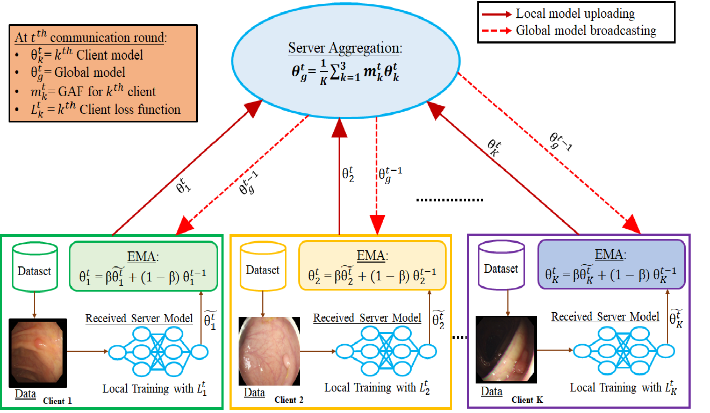

# GAFSEG: GRADIENT-AWARE FEDERATED LEARNING FOR MEDICAL IMAGE SEGMENTATION
This is the official Pytorch implementation of our ICIP, 2026 paper "GAFSEG: GRADIENT-AWARE FEDERATED LEARNING FOR MEDICAL IMAGE SEGMENTATION".

> Abstract: Federated learning (FL) enables privacy-preserving medical image segmentation by allowing collaborative training across multiple institutions. However, most existing FL-based medical segmentation methods rely on federated averaging (FedAvg). In the presence of non-IID data distributions, FedAvg may degrade performance due to inconsistent updates from different clients. To address this limitation, we propose gradient-aware federated segmentation (GAFSeg), an FL framework for medical image segmentation. At the server, we introduce a gradient awareness factor (GAF) that adaptively weights client updates based on gradient alignment with the server's aggregated gradient. We also propose a client training technique, termed ProxEMA, that integrates exponential moving-average-based weight updates with a proximal regularization term to suppress model drift across communication rounds. Extensive experiments on multiple publicly available data sources show that the proposed method outperforms the state-of-the-art approaches.
> 

> 
## Dependencies
- Python 3.10
- PyTorch 2.5.1
- NVIDIA GPU + [CUDA](https://developer.nvidia.com/cuda-downloads)

## Create environment and install packages
- `conda create -n GAFSEG python=3.10`
- `conda activate GAFSEG`
- `pip install -r requirements.txt`

## Dataset
The detailed dataset description is given in Section 1 of the supplementary document.

Polyp: [Kvasir](https://datasets.simula.no/kvasir-seg/), [CVC-ClinicDB](https://polyp.grand-challenge.org/CVCClinicDB/), [CVC-ColonDB](https://ieeexplore.ieee.org/document/7294676), [CVC-300](https://arxiv.org/abs/1612.00799), [EndoTectETIS](https://link.springer.com/article/10.1007/s11548-013-0926-3) and [CVC-300](https://www.kaggle.com/datasets/nourabentaher/cvc-300).

ISIC: [ISIC](https://challenge.isic-archive.com/data/)

Please download all the dataset and place them in the project directory. The folder structure within `data` should be organized as follows.
```
data/
├── polyp/
│   ├── CVC-300/
│   │   ├── image/
│   │   └── mask/
│   ├── CVC-ClinicDB/
│   ├── CVC-ColonDB/
│   ├── EndoTect-ETIS/
│   └── Kvasir/
│
└── isic/
    ├── D1/
    ├── D2/
    ├── D3/
    ├── D4/
    └── D5/
```

### Training 
Run the training scripts:

For polyp dataset-

```
$ python train.py --data polyp --img_path data --device 0
```
For isic dataset-
```
$ python train.py --data isic --img_path data --device 0
```
### Testing

Download the log folders from [checkpoints](https://drive.google.com/drive/folders/1wUlGH0Zr3oTx9iJzttvi3xXgVb-qddik?usp=drive_link) and place them in the project directory

Run the following scripts:

```
$ python test.py --data polyp --img_path data --device 0
```
```
$ python test.py --data isic --img_path data --device 0
```
